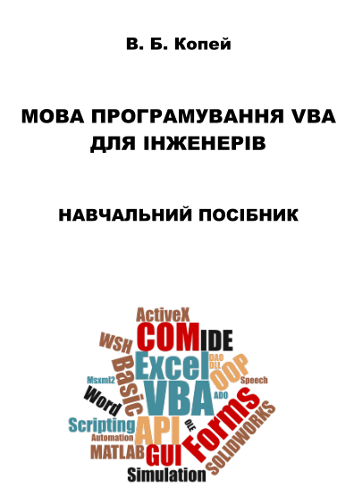

# Code for the book "VBA for engineers" (written in Ukrainian)
Приклади програм для навчального посібника ["Мова програмування VBA для інженерів"](https://github.com/vkopey/VBA-for-engineers/blob/master/%D0%9C%D0%BE%D0%B2%D0%B0%20%D0%BF%D1%80%D0%BE%D0%B3%D1%80%D0%B0%D0%BC%D1%83%D0%B2%D0%B0%D0%BD%D0%BD%D1%8F%20VBA.pdf)

Навчальний посібник містить приклади програм мовою VBA з коментарями. Розглянуто основи програмування та використання COM-об’єктів для створення програм з графічним інтерфейсом користувача, роботи з офісними програмами Excel і Word, сервером сценаріїв Windows, САПР SOLIDWORKS, математичним пакетом MATLAB, доступу до даних тощо. Призначено для вивчення дисциплін "Основи програмування" та "Об’єктно-орієнтоване програмування", а також для виконання курсових і магістерських робіт під час підготовки бакалаврів і магістрів за спеціальністю 131 - Прикладна механіка.

>Копей В. Б. Мова програмування VBA для інженерів: Навчальний посібник / В. Б. Копей - Івано-Франківськ: ІФНТУНГ, 2019. - 125 с.

